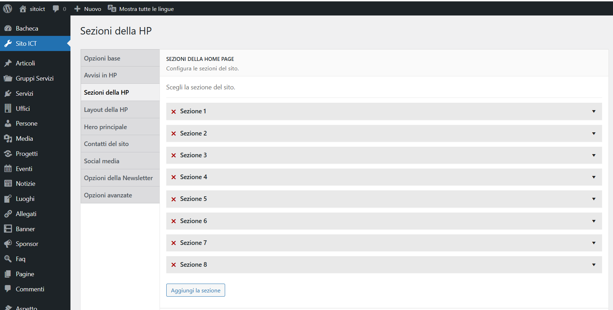
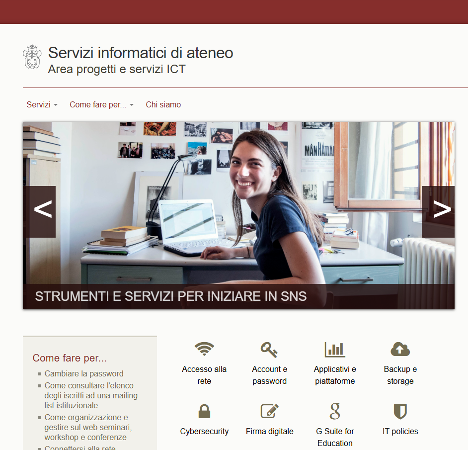
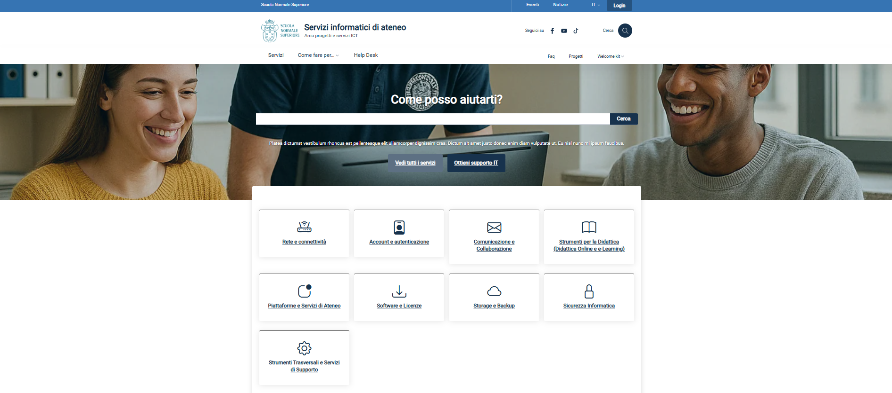
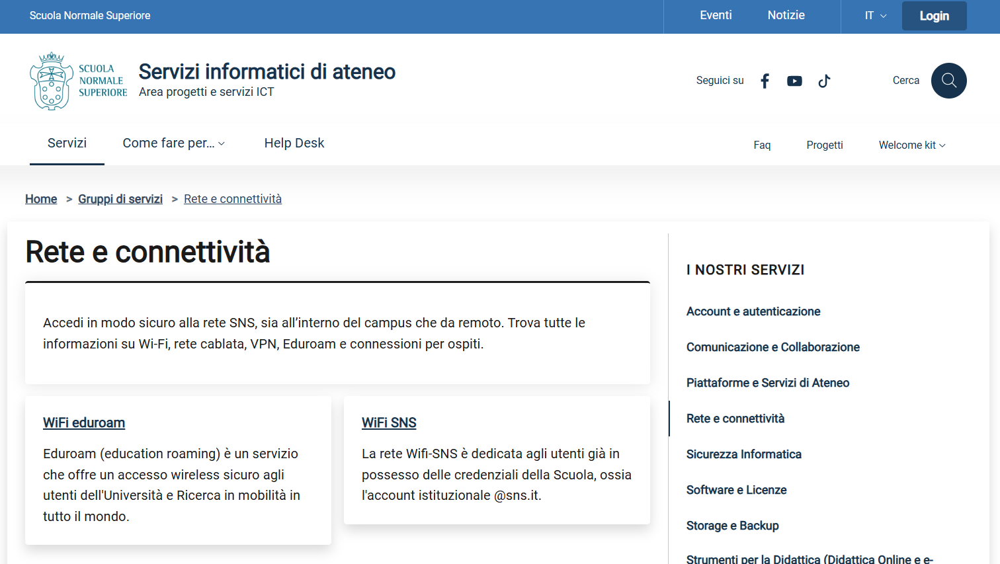
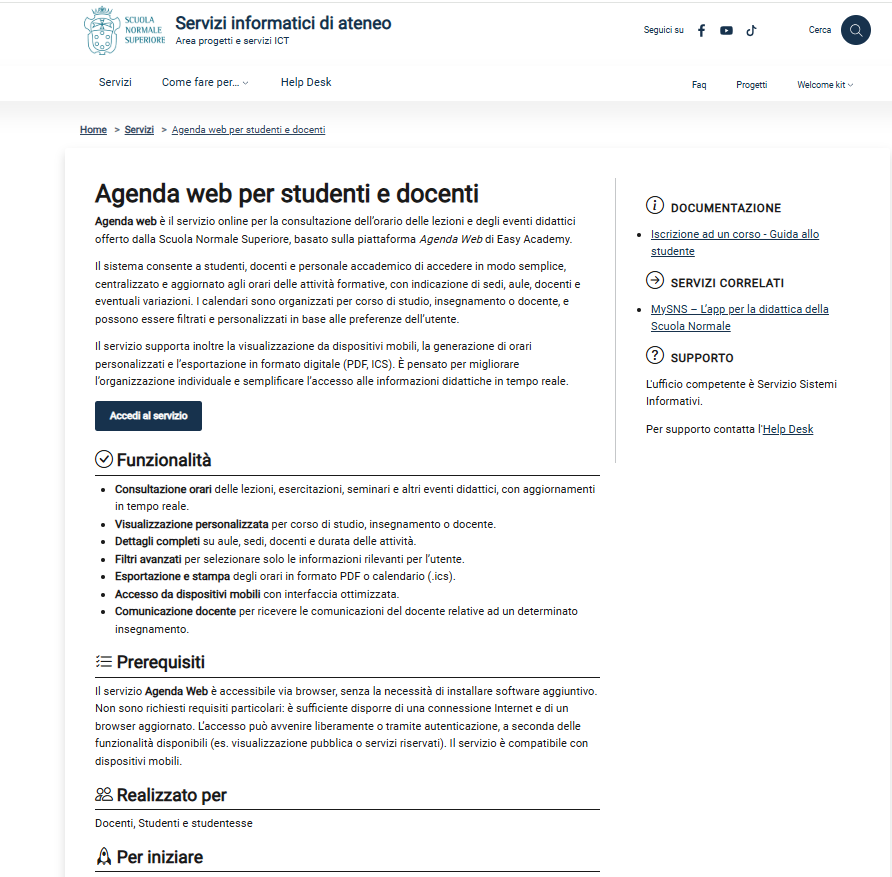
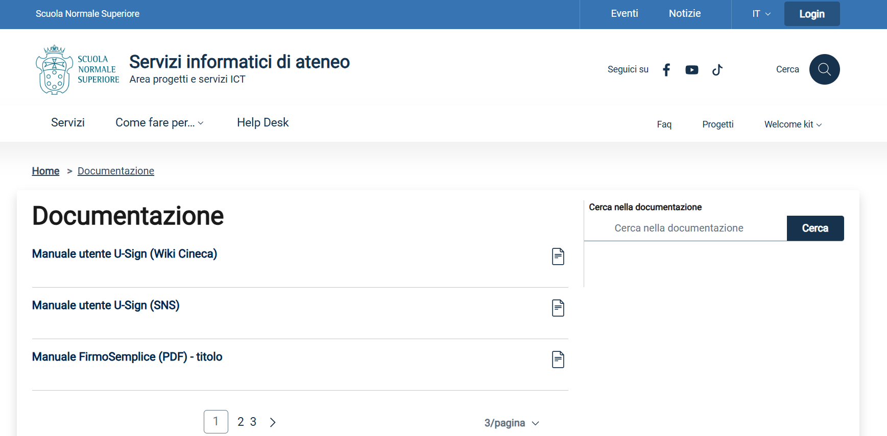
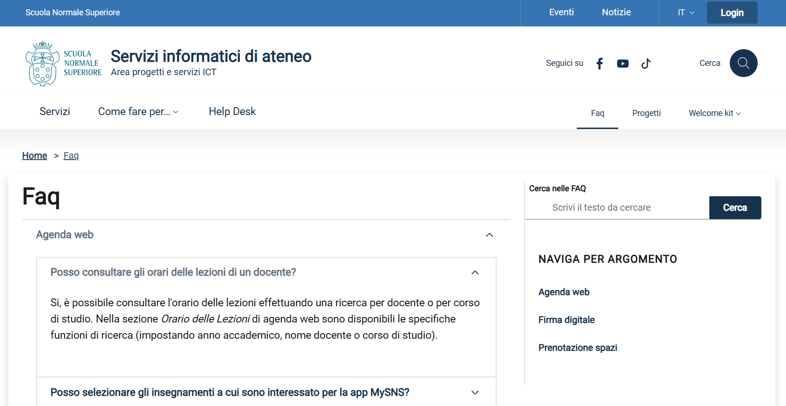

#  Theme for ICT sites
**WordPress theme** for building websites that showcase and facilitate the use of an organization’s ***ICT services***.

## Project status
The project is stable. The current release is **1.0.0**.
All notable changes are documented in [CHANGELOG.md](CHANGELOG.md).


## Credits
This project uses the library [***Bootstrap Italia***](https://italia.github.io/bootstrap-italia/). All plugins and libraries used by the theme are listed in the file [CREDITS.txt](https://github.com/ScuolaNormaleSuperiore/design-ictsite-wp-theme/blob/main/CREDITS.txt).

## Features

### Content
- Management of the ICT services and service clusters.
- Services filtered by user profile.
- Management of the ICT staff, offices and site locations.
- Management of the ICT projects.
- Management of news, events and blog articles.
- Management of ICT FAQ, organized by topic, and of documents.
- Management of sponsors and of home page banners.
- Archive pages with pagination.

### Search
- Search across all site content.
- Search within the FAQ, with results paginated on the FAQ page.
- Search within the documentation.
- Optional autocomplete on the home page, the site search page, the FAQ page and the documentation page, each one independently enabled from the back office.

### Site setup and configuration
- Automatic site population (pages and menus) on activation, repeatable from *Appearance → Reload theme data*.
- Back office section for theme and content configuration.
- Customization of the home page layout and of its sections (hero, clusters, events, news, projects, featured contents, articles, banners, sponsors, video).
- Management of site alerts.
- Newsletter data and contact information.
- Web analytics code and SEO options.
- Cookie management.
- Dedicated 404 page.
- HTML and XML sitemaps.
- Export of FAQ and services in JSON format.
- Multi-language support through Polylang.

## Requirements
1. WordPress >= 6.1.1 (tested up to 7.1).
2. PHP >= 8.0.
3. The plugins listed under [Dependencies](#dependencies).

Node.js and npm are required only to rebuild the theme stylesheet, as described under
[Layout customization](#layout-customization-font-and-colors); they are not needed to run the theme.

## Repository
This is an open-source project. [Here](https://github.com/ScuolaNormaleSuperiore/design-ictsite-wp-theme) you can find the repository that contains the code of the project.


## License
The theme is released under the terms of the [GNU General Public License v3.0](LICENSE), as declared in
`publiccode.yml` (`license: GPL-3.0-only`). The full text is available in the [LICENSE](LICENSE) file.

## Reuse Catalogue
The project is published in the Developers Italia reuse catalog. [This](https://developers.italia.it/it/software/721253b5-4075-4f9f-b16c-eb3eee57cd36) the project Home Page.

## Documentation
   - [User manual (IT)](https://github.com/ScuolaNormaleSuperiore/design-ictsite-wp-theme/wiki).
   - [Operator manual (IT, PDF)](https://github.com/ScuolaNormaleSuperiore/design-ictsite-wp-theme/blob/main/DOC/Sito_ICT_Manuale_operatore_generico.pdf).
   - [Post-type and taxonomy schema](https://github.com/ScuolaNormaleSuperiore/design-ictsite-wp-theme/blob/main/DOC/ICT-SiteContentTypes.pdf).
   - [How to update Bootstrap Italia](https://github.com/ScuolaNormaleSuperiore/design-ictsite-wp-theme/blob/main/DOC/How%20to%20update%20Bootstrap%20Italia.md).
   - [Changelog](CHANGELOG.md).

## Sitemap
The theme provides both a user-facing HTML sitemap and XML sitemaps for search engines.

- The HTML sitemap is rendered from a shared sitemap tree and is exposed through the dedicated site map page template.
- The XML sitemap is exposed through dedicated endpoints, not through standard WordPress pages.
- `sitemap-index.xml` lists one XML sitemap for each language registered in Polylang.
- Each language sitemap is exposed with the pattern `sitemap-{lang}.xml`, for example `sitemap-it.xml` or `sitemap-en.xml`.
- HTML and XML outputs share the same internal tree builder so they stay aligned as the site structure evolves.

## Demo
### Docker
You can test the theme using a *Docker* container that contains all the required software components (Wordpress + theme + plugins + sample content).
The Dockerfile to use is: [Dockerfile](https://github.com/ScuolaNormaleSuperiore/design-ictsite-wp-theme/blob/main/SETUP/Docker/Dockerfile).

The demo site refers to a sample ICT site called **ICT Demo** that is already configured and populated with sample content. The purpose of ICT Demo is to demonstrate the system's features and allow for quick testing; it is not intended for use in production environments.

The commands to run to create and run the container are:
- docker build -t demoict-img -f SETUP/Docker/Dockerfile .
- docker run -p 80:80 -p 3306:3306 --name=demoict -d demoict-img
 
To connect to the container shell, run the command:
- docker exec -it demoict /bin/bash
  
The URL of the newly created site is: http://localhost/.

To authenticate as a site administrator, the URL is http://localhost/wp-admin/ and the login account is: *manager* / *password*.

The *Adminer* tool is installed on the container to manage the database tables.
The *Adminer* URL is: http://localhost/adminer.php
To configure it, the parameters are:
- System: Mysql
- Server: 127.0.0.1
- User: admin
- Password: admin
- Database: demoictdb

## Dependencies
For the theme to function correctly, you must install the following plugins:
* [ACF OpenStreetMap Field](https://wordpress.org/plugins/acf-openstreetmap-field)
* [Advanced Custom Fields](https://wordpress.org/plugins/advanced-custom-fields)
* [Polylang](https://it.wordpress.org/plugins/polylang)
* [WP Mail SMTP](https://it.wordpress.org/plugins/wp-mail-smtp)
* [Really Simple CAPTCHA](https://it.wordpress.org/plugins/really-simple-captcha)

The theme displays a warning when one of these plugins is not installed.

## Roles and Permissions
Installing the theme adds a role called **Super Editor**, which has the same permissions as an Editor, plus the ability to configure the theme (WP->Configuration) and modify the theme menus (WP->Appearance).


## Export data
The theme adds an **Export data** page under *WP->Appearance*, reserved to administrators
(`manage_options`). From there the following content can be downloaded as JSON:
* the FAQ, with their topics, as `faq-export-<date>.json`;
* the services, with the related data, as `services-export-<date>.json`.

## Theme installation and configuration
After installing WordPress on a server, follow these steps to install and configure the **Design ICT site** theme:

1. Download the theme ["Design ICT site"](https://github.com/ScuolaNormaleSuperiore/design-ictsite-wp-theme).
2. Copy the ***design-ictsite-wp-theme*** folder to *<wordpress_installation>/wp-content/themes/*
3. Activate the theme (automatic creation of default content and menus).
4. Install and activate dependent plugins (a popup displays the list of required plugins).
5. Configure Polylang using the plugin wizard:
   
	5.1 Go to *WP->Languages->Configuration* and add the Italian (default) and English languages.

	5.2 Set: *Allow Polylang to translate media*.

	5.3 Set *Choose the language to assign* = it.

6. Create default content: *WP->Appearance->Reload theme data -> Reload activation data (menus, pages, taxonomies, etc.)*
7. In *WP->Appearance->Menus*, click **Save menu**.
8. Theme Setup: Go to *WP->Configuration* and set your configuration data.
**Back office: theme configuration**


## Layout customization (font and colors)
Fonts and colors come from two stylesheets shipped with the theme:
* [assets/css/bootstrap-italia-custom.min.css](assets/css/bootstrap-italia-custom.min.css): the Bootstrap Italia library compiled from the theme sources, where the library variables are overridden.
* [assets/css/custom-colors.css](assets/css/custom-colors.css): additional colour overrides applied on top of the library.

The compiled stylesheet is generated from [assets/scss/bootstrap-italia-custom.scss](assets/scss/bootstrap-italia-custom.scss). To change fonts or colours, edit the SCSS source and rebuild, following the procedure described in the [Library Customization](https://italia.github.io/bootstrap-italia/docs/get-started/customization-of-the-library/) document or these steps:

1. Access the template's root directory: ***design-ictsite-wp-theme*** using a shell.
2. Run the command ***npm install*** to create the *node-modules* folder with all relevant dependencies.
3. Edit [assets/scss/bootstrap-italia-custom.scss](assets/scss/bootstrap-italia-custom.scss) to specify the values that need to be modified.
4. Run the command ***npm run update_layout_win*** or ***npm run update_layout_linux***. This command regenerates `assets/css/bootstrap-italia-custom.min.css`, overwriting the existing one.

Other guides on this topic:
* [Customizing the Library](https://italia.github.io/bootstrap-italia/docs/come-iniziare/personalizzazione-della-libreria).
* [List of Editable Variables](https://github.com/italia/bootstrap-italia/tree/main/src/scss).
* [Color Encoding Tool](https://rgb.to/).
* [Google Fonts](https://fonts.google.com).

## Tickets and bug fixes
To report bugs, please use the [Issues](https://github.com/ScuolaNormaleSuperiore/design-ictsite-wp-theme/issues) section of the project repository.

## Verify publiccode.yml file
The ***publiccode.yml*** file is used to publish the project in the [reuse catalog](https://developers.italia.it/it/software/721253b5-4075-4f9f-b16c-eb3eee57cd36). To verify its correctness, you can use this [procedure](https://github.com/italia/publiccode-parser-go).
```
go install github.com/italia/publiccode-parser-go/v4/publiccode-parser@latest
cd <theme_folder_root>
publiccode-parser publiccode.yml
```

## Gallery

**Home page: the main hero**


**Home page: service clusters**


**Service cluster**


**Service item**


**Documentation**


**FAQ**



## Automatic checks

