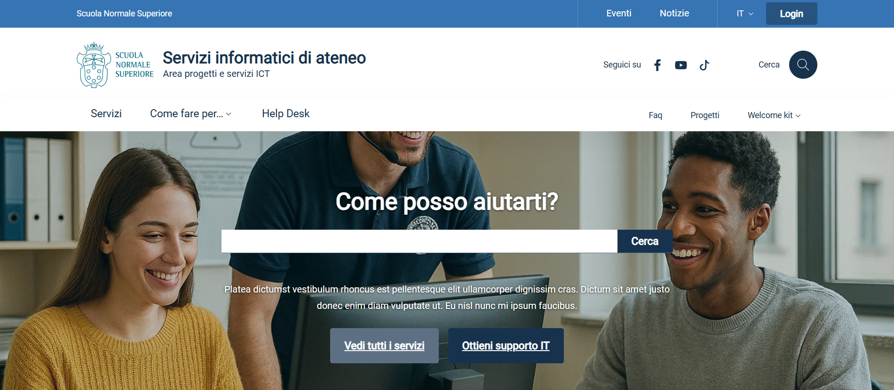

#  Theme for ICT sites
**WordPress theme** for building websites that showcase and facilitate the use of an organization’s ***ICT services***.

## Project status
The project is in beta testing.


## Credits
This project uses the library [***Bootstrap Italia 2.16.0***](https://italia.github.io/bootstrap-italia/). All plugins and libraries used by the theme are listed in the file [CREDITS.txt](https://github.com/ScuolaNormaleSuperiore/design-ictsite-wp-theme/blob/main/CREDITS.txt).

## Features
	- Automatic site population (pages and menu).
	- Section for theme and content configuration.
	- Customization of the home page layout.
	- Management of the ICT staff.
	- Management of the ICT projects.
	- Management of news and events.
	- Management of site locations.
	- Management of ICT Faq and documents.
	- Management of blog articles.
	- Archive pages with pagination.
	- Search across all site content.
	- Management of site alerts.
	- Cookie management.
	- Sitemap.
	- Hero section management on the home page.
	- Management of events, news, and article sections on the home page.
	- Banner management on the home page.
	- Multi-language support.

## Requirements
1. WordPress (version >= 6.1.1).

## Repository
This is an open-source project. [Here](https://github.com/ScuolaNormaleSuperiore/design-ictsite-wp-theme) you can find the repository that contains the code of the project.


## Reuse Catalogue
The project is published in the Developers Italia reuse catalog. [This](https://developers.italia.it/it/software/721253b5-4075-4f9f-b16c-eb3eee57cd36) the project Home Page.

## Documentation
   - [User manual (IT)](https://github.com/ScuolaNormaleSuperiore/design-ictsite-wp-theme/wiki).
   - [Post-type and taxonomy schema](https://github.com/ScuolaNormaleSuperiore/design-ictsite-wp-theme/blob/main/DOC/ICT-SiteContentTypes.pdf).
   - [How to update Bootstrap Italia](https://github.com/ScuolaNormaleSuperiore/design-ictsite-wp-theme/blob/main/DOC/How%20to%20update%20Bootstrap%20Italia.md).

## Demo
### Docker
You can test the theme using a *Docker* container that contains all the required software components (Wordpress + theme + plugins + sample content).
The Dockerfile to use is: [Dockerfile](https://github.com/ScuolaNormaleSuperiore/design-ictsite-wp-theme/blob/main/DEV/Docker/Dockerfile).

The demo site refers to a sample ICT site called **ICT Demo** that is already configured and populated with sample content. The purpose of ICT Demo is to demonstrate the system's features and allow for quick testing; it is not intended for use in production environments.

The commands to run to create and run the container are:
- docker build -t demoict-img -f Dockerfile .
- docker run -p 80:80 -p 3306:3306 --name=demoict -d demoict-img
 
To connect to the container shell, run the command:
- docker exec -it demoict /bin/bash
  
The URL of the newly created site is: http://localhost/.

To authenticate as a site administrator, the URL is http://localhost/wp-admin/ and the login account is: *manager* / *password*.

The *Adminer* tool is installed on the container to manage the database tables.
The *Adminer* URL is: http://localhost/adminer.php
To configure it, the parameters are:
- System: Mysql
- Server: 127.0.0.1
- User: admin
- Password: admin
- Database: demoictdb

## Dependencies
For the theme to function correctly, you must install the following plugins:
* [ACF OpenStreetMap Field](https://wordpress.org/plugins/acf-openstreetmap-field)
* [Advanced Custom Fields](https://wordpress.org/plugins/advanced-custom-fields)
* [Polylang](https://it.wordpress.org/plugins/polylang)
* [WP Mail SMTP](https://it.wordpress.org/plugins/wp-mail-smtp)
* [Really Simple CAPTCHA](https://it.wordpress.org/plugins/really-simple-captcha)

The theme displays a warning when one of these plugins is not installed.

## Roles and Permissions
Installing the theme adds a role called **Super Editor**, which has the same permissions as an Editor, plus the ability to configure the plugin (WP->Configuration) and modify the theme menu (WP->Appearance).


## Theme installation and configuration
After installing WordPress on a server, follow these steps to install and configure the **Design ICT site** theme:

1. Download the theme ["Design ICT site"](https://github.com/ScuolaNormaleSuperiore/design-ictsite-wp-theme).
2. Copy the ***design-ictsite-wp-theme*** folder to *<wordpress_installation>/wp-content/themes/*
3. Activate the theme (automatic creation of default content and menus).
4. Install and activate dependent plugins (a popup displays the list of required plugins).
5. Configure Polylang using the plugin wizard:
   
	5.1 Go to *WP->Languages->Configuration* and add the Italian (default) and English languages.

	5.2 Set: *Allow Polylang to translate media*.

	5.3 Set *Choose the language to assign* = it.

6. Create default content: *WP->Appearance->Reload data-> Reload activation data (menus, pages, taxonomies, etc.)*
7. In *WP->Appearance->Menus*, click **Save menu**.
8. Theme Setup: Go to *WP->Configuration* and set your configuration data.
**Immagine 1:** Backoffice: theme configuration.


## Layout customization (font and colors)
In *WP->Configuration->More->Site Style* you can choose between:
* **Standard Bootstrap Italia Style**: Style that uses the default colors and fonts from the Bootstrap Italia library.
* **Custom Style**: Style that uses custom colors and fonts from the [bootstrap-italia-custom.min.css](assets/scss/bootstrap-italia-custom.min.css) and [custom-colors.css](assets/css/custom-colors.css) files.

The [bootstrap-italia-custom.min.css](assets/scss/bootstrap-italia-custom.min.css) file can be created using the procedure described in the [Library Customization](https://italia.github.io/bootstrap-italia/docs/get-started/customization-of-the-library/) document or by following these steps:

1. Access the template's root directory: ***design-ictsite-wp-theme*** using a shell.
2. Run the command ***npm install*** to create the *node-modules* folder with all relevant dependencies.
3. Edit the [bootstrap-italia.scss] file (assets/scss/bootstrap-italia-custom.scss) to specify the values that need to be modified and regenerated.
4. Run the command ***npm run update_layout_win*** or ***npm run update_layout_linux***. This command creates a new *bootstrap-italia-custom.min* file that overwrites the existing one.

Other guides on this topic:
* [Customizing the Library](https://italia.github.io/bootstrap-italia/docs/come-iniziare/personalizzazione-della-libreria).
* [List of Editable Variables](https://github.com/italia/bootstrap-italia/tree/main/src/scss).
* [Color Encoding Tool](https://rgb.to/).
* [Google Fonts](https://fonts.google.com).

## Tickets and bug fixes
To report bugs, please use the [Issues](https://github.com/ScuolaNormaleSuperiore/design-ictsite-wp-theme/issues) section of the project repository.

## Verify publiccode.yml file
The ***publiccode.yml*** file is used to publish the project in the [reuse catalog](https://developers.italia.it/it/software/721253b5-4075-4f9f-b16c-eb3eee57cd36). To verify its correctness, you can use this [procedure](https://github.com/italia/publiccode-parser-go).
```
go install github.com/italia/publiccode-parser-go/v4/publiccode-parser@latest
cd <plugin_folder_root>
publiccode-parser publiccode.yml
```

## Gallery

**Immagine 1:** Homepage: the main hero.

**Immagine 2:** Homepage: service clusters.

**Immagine 3:** Service cluster.

**Immagine 4:** Service item.

**Immagine 5:** Documentation.

**Immagine 6:** FAQ.


## Automatic checks
